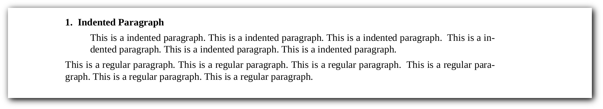
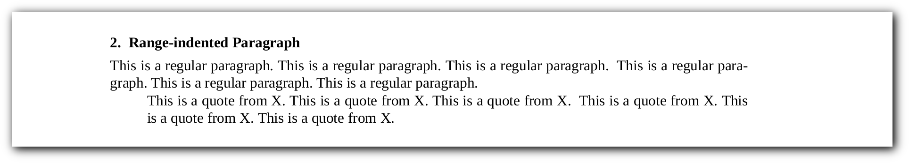
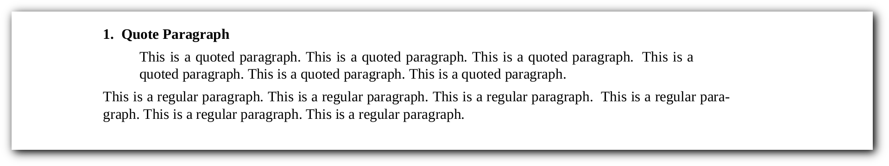
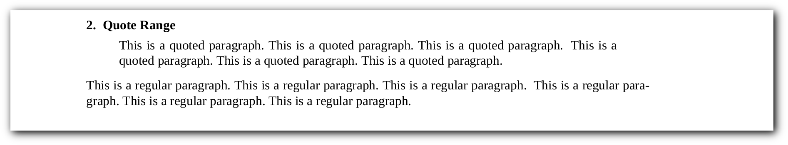
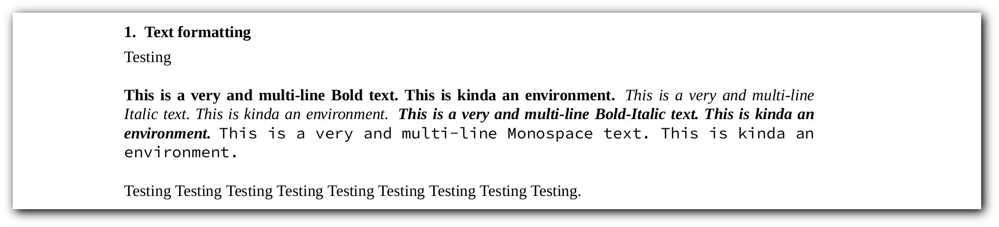
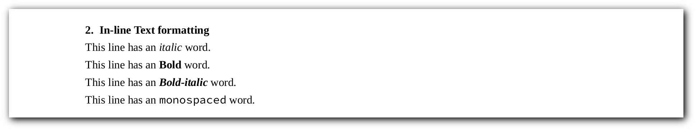
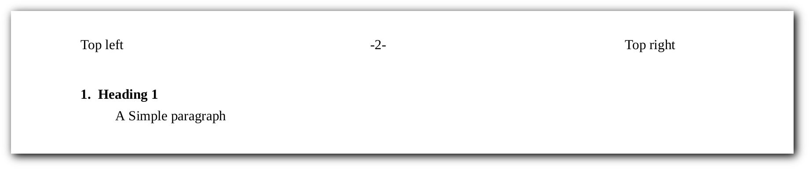
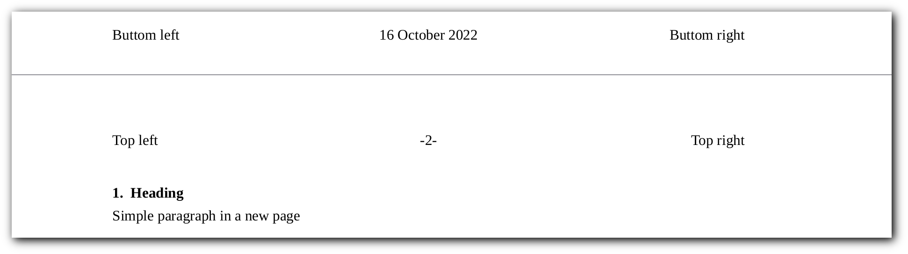
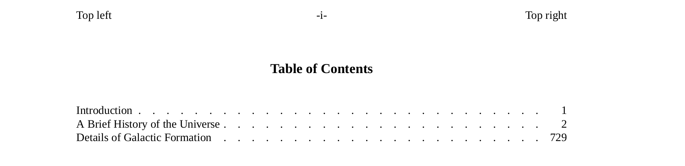

# Groff Cheatsheet

[Groff](http://savannah.gnu.org/projects/groff)
(GNU troff) is a typesetting system that reads plain text mixed with
formatting commands and produces formatted output. Output may be PostScript,
PDF, html, or ASCII/UTF8 for display at the terminal. Formatting commands may
be either low-level typesetting requests ("primitives") or macros from a
supplied set. Users may also write their own macros.
All three may be combined.

Present on most Unix systems owing to its long association with Unix manuals
(manpages), groff is capable of producing typographically sophisticated
documents while consuming only minimal system resources. 

Groff is released under the
[GNU General Public License](http://www.gnu.org/copyleft/gpl.html).

## Compile <!--{{{-->

We need to compile our document into `ps` (PostScript)
or `pdf` (Portable Document Format) formats which will be done by
redirection:

| **Decription** | **Command** |
|----------------|-------------|
| ps format (Default) | `$ groff -ms file.ms > output.ps` |
| pdf format | `$ groff -ms -Tpdf file.ms > output.pdf` |
| We also can compile with `-mspdf` flag to have some extra features like *Table of Contents*: | `$ groff -mspdf -Tpdf file.ms > output.pdf` |

<!--}}}-->
## Comments <!--{{{-->

`groff` has three way to create a comment:

```roff
\" This is a comment
.\" Also a comment but, it has to be at the beginning of the line
.ig
This is a multiline comment
everything in this block will be ignored.
..
```

<!--}}}-->
## Keep that in mind

The macros should be called at the beginning of a line.

## Title <!--{{{-->

Every document (in general, not in groff) at least needs a *title* and *author*:

```roff
.TL
The Title
.AU
The Author
```

We can add institution:

```roff
.AI
Home
```

We can also have abstraction:

```roff
.AB
This is an abstraction
.AE
```


To have an abstraction without the *abstraction* keyword,
simple give `.AB` the `no` argument:

```roff
.AB no
This is an abstraction
.AE
```

<!--}}}-->
## Headings <!--{{{-->

- Ordered / Numbered
- Unordered

### Numbered / Ordered headings <!--{{{-->

```roff
.NH 1
Heading level 1
.NH 2
Heading level 2
.NH 3
Heading level 3
.NH 4
Heading level 4
.NH 5
Heading level 5
.NH 6
Heading level 6
```


The `.NH` macro without any arguments (levels) is level 1 by default.

<!--}}}-->
### Unordered headings <!--{{{-->

```roff
.SH
A Simple heading
.SH 2
A Simple heading
```


<!--}}}-->
<!--}}}-->
## Paragraphs <!--{{{-->

### No-line indented

```roff
.LP
This is a simple paragraph.This is a simple paragraph.This is a simple paragraph.
This is a simple paragraph.This is a simple paragraph.This is a simple paragraph.
```


### First-line indented

```roff
.PP
This is a simple paragraph.This is a simple paragraph.This is a simple paragraph.
This is a simple paragraph.This is a simple paragraph.This is a simple paragraph.
```


### All-but-first-line indented

```roff
.XP
This is a simple paragraph. This is a simple paragraph.
This is a simple paragraph. This is a simple paragraph.
```


### All-indented paragraph

```roff
.NH
Indented Paragraph
.IP
This is a indented paragraph. This is a indented paragraph.
This is a indented paragraph. This is a indented paragraph.
.LP
This is a regular paragraph. This is a regular paragraph.
This is a regular paragraph. This is a regular paragraph.
```



### Range All-indented paragraph

```roff
.NH
Range-indented Paragraph
.LP
This is a regular paragraph. This is a regular paragraph.
This is a regular paragraph. This is a regular paragraph.
.RS
This is a quote from X. This is a quote from X. This is a quote from X.
This is a quote from X. This is a quote from X. This is a quote from X.
.RE
```



<!--}}}-->
## Quote <!--{{{-->

### Paragraph

```roff
.NH
Quote Paragraph
.QP
This is a quoted paragraph. This is a quoted paragraph. This is a quoted paragraph.
This is a quoted paragraph. This is a quoted paragraph. This is a quoted paragraph.
.LP
This is a regular paragraph. This is a regular paragraph. This is a regular paragraph.
This is a regular paragraph. This is a regular paragraph. This is a regular paragraph.
```



### Specific range

```roff
.NH
Quote Range
.QS
This is a quoted paragraph. This is a quoted paragraph. This is a quoted paragraph.
This is a quoted paragraph. This is a quoted paragraph. This is a quoted paragraph.
.QE
.LP
This is a regular paragraph. This is a regular paragraph. This is a regular paragraph.
This is a regular paragraph. This is a regular paragraph. This is a regular paragraph.
```



<!--}}}-->
## Text formatting <!--{{{-->

### By macro <!--{{{-->

#### Italic

```roff
.I
This is Italic text.
```

#### Bold

```roff
.B
This is Bold text.
```

#### Bold-Italic

```roff
.BI
This is Bold-Italic text.
```

#### Monospace

```roff
.CW
This is a monospace text.
```

Using macros like this, will change the style of the text from the calling macro,
until next macro. And they cannot take argument. But there is an alternative way
which will effect only on a specific strings:

```roff
.I "This is a Italic text."
.B "This is a Bold text."
.BI "This is a Bold-Italic text."
.CW "This is a monospace text."
```


#### Macros argument(s)

First argument is the string.
Second argument is a character to append in the *EOL*.
And the third argument is a character to be inserted in the *BOL*.
These characters will not be effected by the macros.

```roff
.I "Are you kidding right now" ?

.CW "Inside a pair of brackets" ] [

```


Some macros will only effect this way,
for example `.UL` macro to have underlined text:

```roff
This line has an
.UL "underlined"
word.
```


<!--}}}-->
### Font Type <!--{{{-->

This way, we can specify the beginning and ending of the formatting.

```roff
.LP
Testing

.ft B
This is a very and multi-line Bold text. This is kinda an environment.
.ft P
.ft I
This is a very and multi-line Italic text. This is kinda an environment.
.ft P
.ft BI
This is a very and multi-line Bold-Italic text. This is kinda an environment.
.ft P
.ft CW
This is a very and multi-line Monospace text. This is kinda an environment.
.ft P
Testing Testing Testing Testing Testing Testing Testing Testing Testing.
```



<!--}}}-->
### In-line formatting <!--{{{-->

```roff
.NH
In-line Text formatting
.LP
This line has an \f[I]italic\f[] word.
.LP
This line has an \f[B]Bold\f[] word.
.LP
This line has an \f[BI]Bold-italic\f[] word.
.LP
This line has an \f[CW]monospaced\f[] word.
```



<!--}}}-->
<!--}}}-->
## Text size <!--{{{-->

### Global <!--{{{-->

```roff
.nr PS 18
```

<!--}}}-->
### Until Next Macro <!--{{{-->

#### Larger

```roff
.LP
Simple Text Simple Text Simple Text Simple Text Simple Text Simple Text Simple Text
.LP
.LG
Simple Larger Text Simple Larger Text Simple Larger Text Simple Larger Text
.LP
Simple Text Simple Text Simple Text Simple Text Simple Text Simple Text Simple Text
```


#### Smaller

```roff
.LP
Simple Text Simple Text Simple Text Simple Text Simple Text Simple Text Simple Text
.LP
.SM
Simple Smaller Text Simple Smaller Text Simple Smaller Text Simple Smaller Text
.LP
Simple Text Simple Text Simple Text Simple Text Simple Text Simple Text Simple Text
```


<!--}}}-->
<!--}}}-->
## Page styling <!--{{{-->

### Footer and Header <!--{{{-->

```roff
.ds RH Top right
.ds CH -%- \" reserved for page number
.ds LH Top left
.ds RF Buttom right
.ds CF \*(DY \" reserved for current date
.ds LF Buttom left
```




<!--}}}-->
### Page Break <!--{{{-->

```roff
.bp
.NH
Heading
.LP
Simple paragraph in a new page
```



<!--}}}-->
### Separator <!--{{{-->

#### Vertical <!--{{{-->

```roff
.LP
Simple test Simple test Simple test Simple test Simple test Simple test Simple test
.sp 5
.LP
Simple test Simple test Simple test Simple test Simple test Simple test Simple test
```


<!--}}}-->
#### Horizontal <!--{{{-->

```roff
.
```

<!--}}}-->
<!--}}}-->
<!--}}}-->
## Table of Contents 

```roff
.XS 1
Introduction
.XA 2
A Brief History of the Universe
.XA 729
Details of Galactic Formation
.XE
.TC
```


