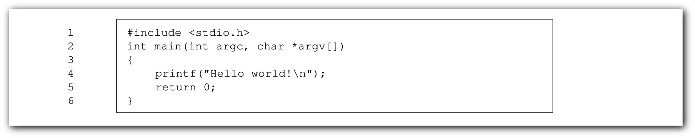

# Groff Cheatsheet

[Groff](http://savannah.gnu.org/projects/groff)
(GNU troff) is a typesetting system that reads plain text mixed with
formatting commands and produces formatted output. Output may be PostScript,
PDF, html, or ASCII/UTF8 for display at the terminal. Formatting commands may
be either low-level typesetting requests ("primitives") or macros from a
supplied set. Users may also write their own macros. All three may be combined.

Present on most Unix systems owing to its long association with Unix manuals
(manpages), groff is capable of producing typographically sophisticated
documents while consuming only minimal system resources. 

Groff is released under the
[GNU General Public License](http://www.gnu.org/copyleft/gpl.html).

## Compile <!--{{{-->

We need to compile our document into `ps` (PostScript) or `pdf` (Portable Document Format) formats:

1. ps format:

    ```sh
    $ groff -ms file.ms > output.ps
    $_
    ```
1. pdf format:

    ```sh
    $ groff -ms -Tpdf file.ms > output.pdf
    $_
    ```
    - We also can compile with `-mspdf` flag to have some extra features like TOC:

        ```sh
        $ groff -mspdf file.ms > output.pdf
        $_
        ```

<!--}}}-->
## Comments <!--{{{-->

`groff` has three way to create a comment:

```roff
\" This is a comment
.\" Also a comment but, it has to be at the beginning of the line
.ig
This is a multiline comment
everything in this block will be ignored.
..
```

<!--}}}-->
## Macros <!--{{{-->

We can define a macro to stop repeating ourselves and save time,
kinda like functions in every programming language
and exactly like macros in `C` language.

```roff
.de MacroName
\" Body
..
```

And now we can use them just like other macros:

```roff
.MacroName
\" body
```

### Some useful macros <!--{{{-->

Custom bullet list:

```roff
.de list
.IP
\(bu
..
\" usage
.list
Test item one
```


Boxed code block:

```roff
.nr ln 1
.de cb
.QS
.B1
.ft CR
.sp 1n
.br
.sp 1n
.nf
.in +1m
.nm +0 1 1 -5
..
.de /cb
.br
.sp 1n
.nm
.fi
.ft
.in
.B2
.QE
..
\" usage
.cb
#include <stdio.h>
int main(int argc, char *argv[])
{
	printf("Hello world!\\n");
	return 0;
}
./cb
```



<!--}}}-->
<!--}}}-->
## Title <!--{{{-->

Every document (in general, not only in groff) at least needs a *title* and *author*:

```roff
.TL
The Title
.AU
The Author
```

We can add institution:

```roff
.AI
Home
```

We can also have abstraction:

```roff
.AB no
This is an abstraction
.AE
```


<!--}}}-->
## Page formatting <!--{{{-->

We can have page *footer* and *header*:

```roff
.ds RH Top right
.ds CH Top middle \" reserved for page number
.ds LH Top left
.ds RF Buttom right
.ds CF Buttom middle \" reserved for current date (.DA)
.ds LF Buttom left
```

Change font size:

```roff
.nr PS 18
```
<!--}}}-->
