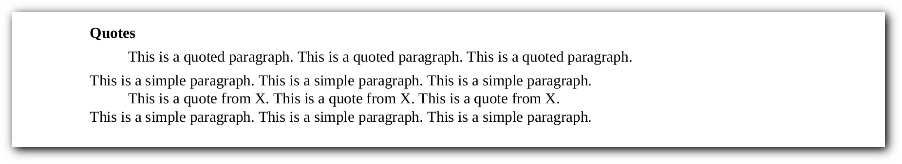
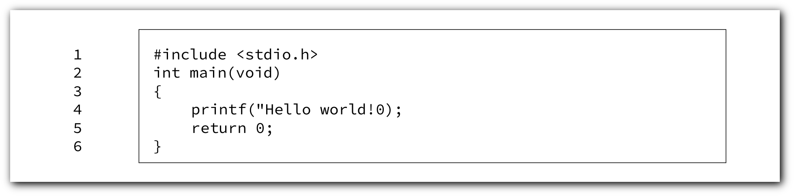

# Groff Cheatsheet

[Groff](http://savannah.gnu.org/projects/groff)
(GNU troff) is a typesetting system that reads plain text mixed with
formatting commands and produces formatted output. Output may be PostScript,
PDF, html, or ASCII/UTF8 for display at the terminal. Formatting commands may
be either low-level typesetting requests ("primitives") or macros from a
supplied set. Users may also write their own macros.
All three may be combined.

Present on most Unix systems owing to its long association with Unix manuals
(manpages), groff is capable of producing typographically sophisticated
documents while consuming only minimal system resources. 

Groff is released under the
[GNU General Public License](http://www.gnu.org/copyleft/gpl.html).

## Compile <!--{{{-->

We need to compile our document into `ps` (PostScript)
or `pdf` (Portable Document Format) formats which will be done by
redirection:


Table: Command-line

| **Decription** | **Command** |
|----------------|-------------|
| ps format (Default) | `$ groff -ms file.ms > output.ps` |
| pdf format | `$ groff -ms -Tpdf file.ms > output.pdf` |
| We also can compile with `-mspdf` flag to have some extra features like *Table of Contents*: | `$ groff -mspdf -Tpdf file.ms > output.pdf` |

<!--}}}-->
## Comments <!--{{{-->

`groff` has three way to create a comment:

```roff
\" This is a comment
.\" Also a comment but, it has to be at the beginning of the line
.ig
This is a multiline comment
everything in this block will be ignored.
..
```

<!--}}}-->
## Title <!--{{{-->

Every document (in general, not only in groff) at least needs a *title* and *author*:

```roff
.TL
The Title
.AU
The Author
```

We can add institution:

```roff
.AI
Home
```

We can also have abstraction:

```roff
.AB
This is an abstraction
.AE
```


To have an abstraction without the *abstraction* keyword,
simple give `.AB` the `no` argument:

```roff
.AB no
This is an abstraction
.AE
```

<!--}}}-->
## Page styling <!--{{{-->

We can have page *footer* and *header*:

```roff
.ds RH Top right
.ds CH Top middle \" reserved for page number
.ds LH Top left
.ds RF Buttom right
.ds CF Buttom middle \" reserved for current date (.DA)
.ds LF Buttom left
```


Change font size:

```roff
.nr PS 18
```
<!--}}}-->
## Headings <!--{{{-->

A groff document can have two types of headings:

- Ordered or Numbered
- Unordered

### Numbered/Ordered headings <!--{{{-->

```roff
.NH 1
Heading level 1
.NH 2
Heading level 2
.NH 3
Heading level 3
.NH 4
Heading level 4
.NH 5
Heading level 5
.NH 6
Heading level 6
```


The `.NH` macro without any arguments (levels) is level 1 by default.

<!--}}}-->
### Unordered headings <!--{{{-->

```roff
.SH
A Simple heading
.SH 2
A Simple heading
```


<!--}}}-->
<!--}}}-->
## Paragraphs <!--{{{-->

We have some options here:

### No-line indented

```roff
.LP
This is a simple paragraph.This is a simple paragraph.This is a simple paragraph.
This is a simple paragraph.This is a simple paragraph.This is a simple paragraph.
```


### First-line indented

```roff
.PP
This is a simple paragraph.This is a simple paragraph.This is a simple paragraph.
This is a simple paragraph.This is a simple paragraph.This is a simple paragraph.
```


### All-but-first-line indented

```roff
.XP
This is a simple paragraph.This is a simple paragraph.This is a simple paragraph.
This is a simple paragraph.This is a simple paragraph.This is a simple paragraph.
```


### Quote <!--{{{-->

#### Paragraph

```roff
.QP
This is a quoted paragraph. This is a quoted paragraph. This is a quoted paragraph.
.LP
This is a simple paragraph. This is a simple paragraph. This is a simple paragraph.
```


#### Specific range

```roff
.SH
Quotes
.QP
This is a quoted paragraph. This is a quoted paragraph. This is a quoted paragraph.
.LP
This is a simple paragraph. This is a simple paragraph. This is a simple paragraph.
.RS
This is a quote from X. This is a quote from X. This is a quote from X.
.RE
This is a simple paragraph. This is a simple paragraph. This is a simple paragraph.
```



<!--}}}-->
<!--}}}-->
## Text formatting <!--{{{-->
<!--}}}-->

\vfill\newpage

## Macros <!--{{{-->

We can define a macro to stop repeating ourselves and save time,
kinda like functions in every programming language
and exactly like macros in `C` language.

```roff
.de MacroName
\" Body
..
```

And now we can use them just like other macros:

```roff
.MacroName
\" body
```

### Some useful macros <!--{{{-->

#### bullet list:

```roff
.de bl
.IP
\(bu
..
\" usage
.bl
Test item one
.bl
Test item two
```


#### Boxed list

```roff
.de bb
.IP
\[sq]
..
\" usage
.bb
TODO item one
.bb
TODO item two
```


#### Boxed code block:

```roff
.nr ln 1
.de cb
.QS
.B1
.ft CR
.sp 1n
.br
.sp 1n
.nf
.in +1m
.nm +0 1 1 -5
..
.de /cb
.br
.sp 1n
.nm
.fi
.ft
.in
.B2
.QE
..
\" usage
.cb
#include <stdio.h>
int main(int argc, char *argv[])
{
	printf("Hello world!\\n");
	return 0;
}
./cb
```



<!--}}}-->
<!--}}}-->
