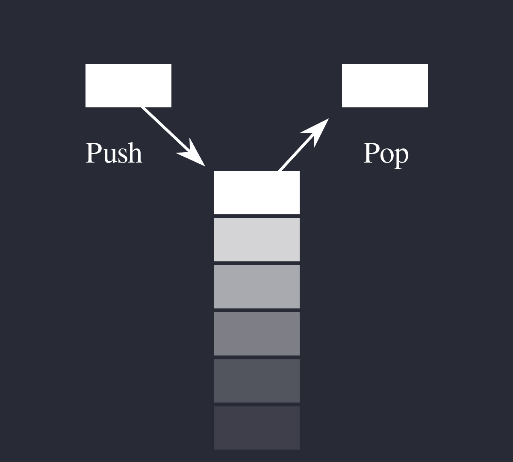

# Lua Cheatsheet <!--{{{-->

Lua is a powerful, fast, lightweight and embeddable programming language.

It is used by many frameworks, games and other
applications. While it can be used by itself, it has been designed to be easy to embed in
another application. It is implemented in ANSI C, a subset of the C programming language
that is very portable, which means it can run on many systems and many devices where most
other scripting languages would not be able to run.

> "Lua" (pronounced LOO-ah) means "Moon" in Portuguese. As such, it is neither an
> acronym nor an abbreviation, but a noun. More specifically, "Lua" is a name, the name
> of the Earth's moon and the name of the language. Like most names, it should be
> written in lower case with an initial capital, that is, "Lua". Please do not write it as
> "LUA", which is both ugly and confusing, because then it becomes an acronym with
> different meanings for different people. So, please, write "Lua" right!

Lua comes from two languages that were designed by TeCGraf (a laboratory at the Pontifical
Catholic University of Rio de Janeiro): DEL and Sol. DEL means "data entry language",
while Sol means "simple object language" and also means sun in Portuguese, which is why
the name Lua was chosen, since it means "moon" in Portuguese. It was created for Petrobras,
a Brazilian oil company, but was also used in many other projects in TeCGraf, and is now
used in a multitude of projects world-wide. Lua is one of the leading languages in the field
of embedded game development.

One of the main advantages of Lua is its simplicity. Some companies use it exclusively
because of that advantage: they think their employees would be able to work better if
they could use a programming language to perform certain tasks, but they cannot afford to
give to their employees a full course on a complicated programming language. Some very
simple languages like Bash or Batch here would not be powerful enough to perform these
tasks, but Lua is both powerful and simple. Another of the important advantages of Lua
is its capability to be embedded, which was one of the most important characteristics of it
throughout all of its development. Games like or World of Warcraft or ROBLOX need to
be able to embed Lua in their application so users of the application can use it.

## Hello, World! <!--{{{-->

Lua can either be used embedded in an application or by itself. This book will not describe
the process to install Lua on your computer, but you can execute code using
[codepad](http://codepad.org)
or
the
[Lua demo](http://www.lua.org/demo.html).
The first example of Lua code in this book will be the basic and traditional
hello world program.

> A **"Hello world" program** is a computer program that outputs "Hello, world" on a display device.
> Because it is typically one of the simplest programs possible in most programming languages,
> it is by tradition often used to illustrate to beginners the most basic syntax of a programming language,
> or to verify that a language or system is operating correctly.

```lua
print("Hello, World!")
```

The code above prints the text `Hello, world!` to the output,
printing referring to displaying text in the output,
not to printing something on paper.
It does so by calling the `print` function with the string "Hello, world!" as an argument.
This will be explained in the chapter about functions.

Note that Lua is most of the time embedded in a lower level application, which means that
the `print` function will not always display text in an area that is visible to the user.
The documentation of the programming interface of these applications will generally explain
how text may be displayed to users.

<!--}}}-->
## Comments <!--{{{-->

A comment is a code annotation that is ignored by the programming language.

There are some way of creating comments in Lua:

```lua
-- this is a comment
print ("Hello") -- another comment
```

These comments are called short (single-line) comments. It is also possible to create long comments,
which start with a long bracket and can continue on many lines:

```lua
--[[
    This is a multi-line comment
]]
io.write("Just a simple test\n")
--[==[
This is a comment that contains
a closing long bracket of level 0 which is here:
]]
However, the closing double bracket doesn't make the comment end,
because the comment was opened with an opening long bracket of level 2,
and only a closing long bracket of level 2 can close it.
]==]
```
<!--}}}-->
## Syntax <!--{{{-->

Lua is a dynamically typed language intended for use as an extension language or scripting language.

Statements and expressions can be respectively compared to sentences and
words. Expressions are pieces of code that have a value and that can be evaluated, while
statements are pieces of code that can be executed and that contain an instruction and one
or many expressions to use that instruction with.

For example, `3 + 5` is an expression and
`variable = 3 + 5` is a statement that sets the value of variable to that expression.

```lua
-- Different types
local x = 10 -- number
local name = "Neo" -- string
local is_alive = false -- boolean
local a = nil -- no value or invalid value
```
<!--}}}-->

## Obtaining Lua

Lua can be obtained on the official Lua website,
on the [download page](http://www.lua.org/download.html).

<!--}}}-->
# Expressions <!--{{{-->

Expressions are pieces of code that have a value and that can be
evaluated. They cannot be executed directly (with the exception of function calls), and
thus, a script that would contain only the following code, which consists of an expression,
would be erroneous:

```lua
3 + 5
-- The code above is erroneous because all it contains is an expression.
-- The computer cannot execute '3 + 5', since that does not make sense.
```

Code must be comprised of a sequence of statements. These statements can contain expressions
which will be values the statement has to manipulate or use to execute the instruction.

Some code examples in this chapter do not constitute valid code, because they consist of
only expressions. In the next chapter, statements will be covered and it will be possible to
start writing valid code.

## Types <!--{{{-->

Lua is a dynamically typed language, so the variables don't have types, only the values have types.

But we have types for the values.
There is a function called ‘type' that enables us to know the type of the variable.

```lua
print(type("What is my type"))   --> string
t = 10

print(type(5.8 * t))             --> number
print(type(true))                --> boolean
print(type(print))               --> function
print(type(nil))                 --> nil
print(type(type(ABC)))           --> string
```

By default, all the variables will point to nil until they are assigned a value
or initialized. In Lua, zero and empty strings are considered to be true in
case of condition checks.

The list of data types for values are given below.

| **Value Type**  | **Description** |
|:----------------|:----------------|
|   `nil`         | Used to differentiate the value from having some data or no(nil) data. |
|   `boolean`     | Includes true and false as values. | Generally used for condition checking. |
|   `number`      | Represents real(double precision floating point) | numbers. |
|   `string`      | Represents array of characters. |
|   `function`    | Represents a method that is written in C or Lua. |
|   `userdata`    | Represents arbitrary C data. |
|   `thread`      | Represents independent threads of execution and  |   it is used to implement coroutines. |
|   `table`       | Represent ordinary arrays, symbol tables, sets, records, graphs, trees, etc., and implements associative arrays. It can hold any value (except nil). |

### Numbers <!--{{{-->

Numbers generally represent quantities, but they can be used for many other things. The
number type in Lua works mostly in the same way as real numbers.

Numbers can be constructed as integers, decimal numbers, decimal exponents or
even in hexadecimal. Here are some valid numbers:

- `3`
- `3.0`
- `3.1416`
- `314.16e-2`
- `0.31416E1`
- `0xff`
- `0x56`

```lua
-- The Lua
local a = 1
local b = 2
local c = a + b
print(c) -- 3

local d = b - a
print(d)

local x = 1 * 3 * 4 -- 12
print(x)

local y = (1+3) * 2 -- 8
print(y)

print(10 / 2) -- 5
print(2 ^ 2) -- 4
print(5 % 2) -- 1
print(-b) -- -2

-- Incerment
local level = 1
level = level + 1
print(level)
```

**Arithmetic operations**

The operators for numbers in Lua are the following:

|  **Operation**          | **Syntax** |                     **Description**                       |  **Example**   |
|:------------------------|:-----------|:----------------------------------------------------------|:---------------|
| **Arithmetic negation** |   `-a`     | Changes the sign of a and returns the value               |   `-3.14159`   |
| **Addition**            |   `a + b`  | Returns the sum of `a` and `b`                            |   `5.2 + 3.6`  |
| **Subtraction**         |   `a - b`  | Subtracts b from a and returns the result                 |   `5.2 + 3.6`  |
| **Multiplication**      |   `a * b`  | Returns the product of a and b                            |   `3.2 * 1.5`  |
| **Exponentiation**      |   `a ^ b`  | Returns a to the power b, or the exponentiation of a by b |   `5 ˆ 2`      |
| **Division**            |   `a / b`  | Divides a by b and returns the result                     |   `6.4 / 2`    |
| **Modulus operation**   |   `a % b`  | Returns the remainder of the division of a by b           |   `5 % 3`      |


**Integers**

A new subtype of numbers, integers, was added in Lua 5.3. Numbers can be either integers
or floats.
Floats are similar to numbers as described above, while integers are numbers with
no decimal part.

Float division (`/`) and exponentiation always convert their operands to
floats, while all other operators give integers if their two operands were integers.
In other cases, with the exception of the floor division operator (`//`) the result is a float.

<!--}}}-->

### Nil

Nil is the type of the value nil, whose main property is to be different from any other value;
it usually represents the absence of a useful value. A function that would return nil, for
example, is a function that has nothing useful to return.

### Boolean <!--{{{-->

A boolean value can be either `true` or `false`, but nothing else.
This is literally written in Lua as `true` or `false`,
which are reserved keywords.
The following operators are often used with boolean values,
but can also be used with values of any data type:

|     **Operation**       | **Syntax** | **Description** |
|:------------------------|:-----------|:----------------|
| **Boolean negation**    | `not a`    | If a is false or nil, returns true. Otherwise, returns false. |
| **Logical conjunction** | `a and b`  | Returns the first argument if it is false or nil. Otherwise, returns the second argument. |
| **Logical disjunction** | `a or b`   |  Returns the first argument if it is neither false nor nil. Otherwise, returns the second argument.               |

Essentially, the `not` operator just negates the boolean value
(makes it false if it is true and makes it true if it is false),
the `and` operator returns true if both are true and false if not
and the `or` operator returns true if either of arguments is true and false otherwise.

```lua
local is_alive = true
print(is_alive) -- true

local is_alive = false
print(is_alive) -- false
```
<!--}}}-->
### Strings <!--{{{-->

Strings are sequences of characters that can be used to represent text. They can be written
in Lua by being contained in double quotes, single quotes or long brackets
(it should be noted that comments and
strings have nothing in common other than the fact they can both be delimited by long
brackets, preceded by two hyphens in the case of comments).

Strings that aren't contained
in long brackets will only continue for one line. Because of this, the only way to make a
string that contains many lines without using long brackets is to use escape sequences. This
is also the only way to insert single or double quotes in certain cases.

1. `' '`
1. `" "`
1. `[[ ]]`

```lua
local phrase = [[My name is ]]
local name = 'P J'
print(phrase .. name) -- My name is P J

-- Strings and Numbers
local age = 21
local name = "Billy"
print(name .. " is " .. age .. " Years old")
```

Escape sequence characters are used in string to change the normal
interpretation of characters.

For example, to print double inverted commas
`("")`, we have to use `\"` in the string.

The escape sequence and its use is listed below in the table.

|  Escape Sequence   |         Use            |
|:-------------------|:-----------------------|
|        `\a`        |  Bell                  |
|        `\b`        |  Backspace             |
|        `\f`        |  Formfeed              |
|        `\n`        |  New line              |
|        `\r`        |  Carriage return       |
|        `\t`        |  Tab                   |
|        `\v`        |  Vertical tab          |
|        `\\`        |  Backslash             |
|        `\"`        |  Double quotes         |
|        `\'`        |  Single quotes         |
|        `\[`        |  Left square bracket   |
|        `\]`        |  Right square bracket  |

It is possible to get the length of a string, as a number, by using the unary length operator
(`#`):

```lua
print(#("This is a string")) --> 16
```

**Concatenation**

> In [formal language theory](https://en.wikipedia.org/wiki/formal%20language)
> and [computer programming](https://en.wikipedia.org/wiki/computer%20programming),
> **string concatenation** is the operation of joining two character
> [strings](https://en.wikipedia.org/wiki/character%20string%20%28computer%20science%29) end-to-end.
> For example, the concatenation of "snow" and "ball" is "snowball".

The string concatenation operator in Lua is denoted by two dots (`..`).

```lua
print("snow" .. "ball") --> snowball
```

<!--}}}-->
### Other types

The four basic types in Lua (numbers, booleans, nil and strings) have been described in
the previous sections, but four types are missing:
functions, tables, userdata and threads.

- *Functions* are pieces of code that can be called, receive values and return values back.
- *Tables* are data structures that can be used for data manipulation.
- *Userdata* are used internally by applications Lua is embedded in to allow
  Lua to communicate with that program through objects controlled by the
  application.
- *Threads* are used by coroutines, which allow many functions to run at the same time.

<!--}}}-->
## Literals

Literals are notations for representing fixed values in source code. All values
can be repre sented as literals in Lua except **threads** and **userdata**.

String literals (literals that evaluate
to strings), for example, consist of the text that the string must represent enclosed into
single quotes, double quotes or long brackets.

Number literals, on the other hand, consist
the number they represent expressed using decimal notation (ex: `12.43`), scientific notation
(ex: `3.1416e-2` and `0.31416E1`) or hexadecimal notation (ex: `0xff`).

## Coercion

Coercion is the conversion of a value of one data type to a value of another data type. Lua
provides automatic coercion between string and number values. Any arithmetic operation
applied to a string will attempt to convert this string to a number.

 Conversely, whenever a
string is expected and a number is used instead, the number will be converted to a string.

This applies both to Lua operators and to default functions (functions that are provided
with the language).

```lua
print("122" + 1) --> 123
print("The number is " .. 5 .. ".") --> The number is 5.
```

Coercion of numbers to strings and strings to numbers can also be done manually with
the `tostring` and `tonumber` functions.

The former accepts a number as an argument and converts it to a string,
while the second accepts a string as an argument and converts it to a number
(a different base than the default decimal one can optionally be given in the second argument).

<!--}}}-->
# Statements <!--{{{-->

*Statements* are pieces of code that can be executed and that contain an instruction and
expressions to use with it. Some statements will also contain code inside of themselves that
may, for example, be run under certain conditions. Dissimilarly to expressions, they can
be put directly in code and will execute.

Lua has few instructions, but these instructions,
combined with other instructions and with complex expressions, give a good amount of
control and flexibility to the user.

## Assignment<!--{{{-->

Programmers frequently need to be able to store values in the memory to be able to use
them later. This is done using variables.

*Variables* are references to a value which is stored in the computer's memory.
They can be used to access a number later after storing it in the memory.

*Assignment* is the instruction that is used to assign a value to a variable. It
consists of the name of the variable the value should be stored in, an equal sign, and the
value that should be stored in the variable:

```lua
variable = 43
print(variable) --> 43
```

As demonstrated in the above code, the value of a variable can be accessed by putting the
variable's name where the value should be accessed.

### Identifiers<!--{{{-->

[Identifiers](https://en.wikipedia.org/wiki/Identifier%23In_computer_science),
in Lua, are also called names. They can be any text composed of letters, digits,
and underscores and **not beginning with a digit**.
They are used to name variables and table fields.

Here are some **valid** names:

- `name`
- `hello`
- `_`
- `_tomatoes`
- `me41`
- `__`
- `_thisIs_StillaValid23name`

Here are some **invalid** names:

- `2hello` : starts with a digit
- `th$i` : contains a character that isn't a letter, a digit or an underscore
- `hel!o` : contains a character that isn't a letter, a digit or an underscore
- `563text` : starts with a digit
- `82_something` : starts with a digit

Also, the following keywords are reserved by Lua and can not be used as names:

```lua
and, end, in, repeat, break, false, local,
return, do, for, nil, then, else, function,
not, true, elseif, if, or, until, while
```

When naming a variable or a table field, you must choose a valid name for it.
It must therefore start with a **letter** or an **underscore** and only contain
**letters**, **underscores** and **digits**.

Note that Lua is case sensitive. This means that `Hello` and `hello` are two different names.
<!--}}}-->
### Scope<!--{{{-->

The [scope of a variable](https://en.wikipedia.org/wiki/Scope%20%28computer%20science%29),
is the region of the code of the program where that variable is meaningful.
The examples of variables you have seen before are all examples of global
variables, variables which can be accessed from anywhere in the program.

Local variables, on the other hand, can only be used from the region of the program
in which they were defined and in regions of the program that are located inside that
region of the program. They are created exactly in the same way as global variables,
but they must be prefixed with the `local` keyword.

The `do` statement will be used to describe them. The `do` statement is a statement that
has no other purpose than to create a new block of code, and therefore a new scope.
It ends with the `end` keyword:

```lua
local variable = 13 --[[ This defines a local variable that can be accessed from
    anywhere in the script since it was defined in the main region. ]]
do
    -- This statement creates a new block and also a new scope.
    variable = variable + 5 -- This adds 5 to the variable, which now equals 18.
    local variable = 17 --[[ This creates a variable with the same name as the
        previous variable, but this one is local to the scope created by
        the do statement. ]]
    variable = variable - 1 --[[ This subtracts 1 from the local variable, which
    now equals 16. ]]
    print(variable) --> 16
end
print(variable) --> 18
```

When a scope ends, all the variables in it are **gotten rid of**.
Regions of code can use variables defined in regions of code they are included in,
but if they "overwrite" them by defining a local variable with the same name,
that local variable will be used instead of the one defined in the other region of code.
This is why the first call to the print function prints `16` while the second,
which is outside the scope created by the do statement, prints `18`.

In practice, only local variables should be used because they can be defined and accessed
faster than global variables, since they are stored in registers instead of being stored in the
environment of the current function, like global variables.

Registers are areas that Lua uses to store local variables to access them quickly,
and can only usually contain up to 200 local variables. The processor,
an important component of all computers, also has registers,
but these are not related to Lua's registers.
Each function (including the main thread, the core of the program, which is also a function)
also has its own environment, which is a table that uses indices for the variable names
and stores the values of these variables in the values that correspond to these indices.
<!--}}}-->
### Forms of assignment<!--{{{-->

Some assignment patterns are sufficiently common for syntactic sugar to have been introduced
to make their use simpler.

**Augmented assignment**

[*Augmented assignment*](https://en.wikipedia.org/wiki/augmented%20assignment),
which is also called *compound assignment*, is a type of assignment
that gives a variable a value that is relative to its previous value. It is used when it is
necessary to change the value of a variable in a way that is relative to its previous value,
such as when that variable's value must be incremented.

In [C](https://en.wikipedia.org/wiki/C%20%28programming%20language%29),
[JavaScript](https://en.wikipedia.org/wiki/JavaScript),
[Ruby](https://en.wikipedia.org/wiki/Ruby%20%28programming%20language%29),
[Python](https://en.wikipedia.org/wiki/Python%20%28programming%20language%29)
and some other languages, the code `a += 8` will increment the value of a by 8. Lua does
not have syntactic sugar for augmented assignment, which means that it is necessary to
write `a = a + 8`.

**Chained assignment**

[*Chained assignment*](https://en.wikipedia.org/wiki/chained%20assignment)
is a type of assignment that gives a single value to many variables.
The code `a = b = c = d = 0`, for example, would set the values of a, b, c and d to 0 in
C and Python. In Lua, this code will raise an error because Lua does not have syntactic
sugar for chained assignment, so it is necessary to write the previous example like this:

```lua
d = 0
c = d -- or c = 0
b = c -- or b = 0
a = b -- or a = 0
```

**Parallel assignment**

[*Parallel assignment*](https://en.wikipedia.org/wiki/parallel%20assignment),
which is also called *simultaneous assignment* and *multiple assignment*,
is a type of assignment that simultaneously assigns different values
(they can also be the same value) to different variables.
Unlike chained assignment and augmented assignment, parallel assignment is available in Lua.

```lua
a, b, c, d = 0, 0, 0, 0
```

- If you provide more variables than values, some variables will be not be assigned any value.
- If you provide more values than variables, the extra values will be ignored.

More technically,
the list of values is adjusted to the length of list of variables before the assignment takes
place, which means that excess values are removed and that extra nil values are added at
its end to make it have the same length as the list of variables.

- If a function call is present *at the end of the values list*,
the values it returns will be added at the end of that list,
unless the function call is put between parentheses.

Moreover, unlike most programming languages Lua enables reassignment of variables' values
through [permutation](https://en.wikipedia.org/wiki/permutation). For example:

```lua
first_variable, second_variable = 54, 87
first_variable, second_variable = second_variable, first_variable
print(first_variable, second_variable) --> 87 54
```

This works because the assignment statement evaluates all the variables and values before
assigning anything. Assignments are performed as if they were really simultaneous, which
means you can assign at the same time a value to a variable and to a table field indexed
with that variable's value before it is assigned a new value. In other words, the following
code will set `dictionary[2]`, and not `dictionary[1]`, to `12`.

```lua
dictionary = {}
index = 2
index, dictionary[index] = index - 1, 12
```
<!--}}}-->
<!--}}}-->
## Conditional statement<!--{{{-->

Conditional statements are instructions that check whether an expression is true
and execute a certain piece of code if it is. If the expression is not true,
they just skip over that piece of code and the program continues.
In Lua, the only conditional statement uses the `if` instruction.
`false` and `nil` are both considered as false, while everything else is considered as true.

```lua
local number = 6
if number < 10 then
    print("The number " .. number .. " is smaller than ten.")
end
--[[ Other code can be here and it will execute regardless of whether the code
in the conditional statement executed. ]]
```

In the code above, the variable number is assigned the number 6 with an assignment statement.
Then, a conditional statement checks if the value stored in the variable number is smaller than ten,
which is the case here. If it is, it prints `"The number 6 is smaller than ten."`.

It is also possible to execute a certain piece of code only if
the expression was not true by using the `else` keyword and to
chain conditional statements with the `elseif` keyword:

```lua
local number = 15
if number < 10 then
    print("The number is smaller than ten.")
elseif number < 100 then
    print("The number is bigger than or equal to ten, but smaller than one hundred.")
elseif number ~= 1000 and number < 3000 then
    print("number is bigger or equal to 100, smaller than 3000 is not exactly 1000.")
else
    print("number is either 1000 or bigger than 2999.")
end
```

Note that the `else` block must always be the last one.
There cannot be an `elseif` block after the `else` block. The `elseif` blocks
are only meaningful if none of the blocks that preceded them was executed.

Operators used to compare two values, some of which are used in the code above,
are called relational operators. If the relation is `true`, they return the
boolean value true. Otherwise, they return the boolean value `false`.

|  operator |        action          |
|:----------|:-----------------------|
|   `==`    |  equal to              |
|   `~=`    |  not equal to          |
|   `<=`    |  less than or equal to |
|   `>=`    |  more than or equal to |
|   `<`     |  less than             |
|   `>`     |  more than             |

The code above also demonstrates how the `and` keyword can be used to combine many
boolean expressions in a conditional expression.
<!--}}}-->
## Loops<!--{{{-->

Frequently, programmers will need to run a certain piece of code or
a similar piece of code many times, or to run a certain piece of code a number
of times that may depend on user input. A loop is a sequence of statements
which is specified once but which may be carried out several times in succession.

### Condition-controlled loops<!--{{{-->

Condition-controlled loops are loops that are controlled by a condition.
They are very similar to conditional statements, but instead of executing the code
if the condition is true and skipping it otherwise, they will keep running it
while the condition is true, or until the condition is false.

Lua has two statements for condition-controlled loops: the `while` loop and
the `repeat` loop. Such loops will run code, then check if the condition is true.
If it is true, then they run the code again, and they repeat until the condition is false.
When the condition is false, they stop repeating the code and the program flow continues.
Each execution of the code is called an iteration.

The difference between `while` and `repeat` loops is that `repeat` loops
will check the condition at the end of the loop `while` while loops
will check it at the start of the loop.
This only makes a difference for the first iteration:
`repeat` loops will always execute the code at least once, even if the condition is false at the
first time the code is executed. This is not the case for `while` loops, which will only execute
the code the first time if the condition is actually true.

```lua
local number = 0
while number < 10 do
    print(number)
    number = number + 1 -- Increase the value of the number by one.
end
```

The code above will print `0`, then `1`, then `2`, then `3`, and so on, until `9`.
After the tenth iteration, *number* will no longer be smaller than ten,
and therefore the loop will stop executing. Sometimes, loops will be meant to run forever,
in which case they are called infinite loops.

Renderers, software processes that draw things on the screen, for example, will often
loop constantly to redraw the screen to update the image that is shown to the user. This
is frequently the case in video games, where the game view must be updated constantly to
make sure what the user sees is kept up-to-date.

However, cases where loops need to run
forever are rare and such loops will often be the result of errors. Infinite loops can take a
lot of computer resources, so it is important to make sure that loops will always end even
if unexpected input is received from the user.

```lua
local number = 0
repeat
    print(number)
    number = number + 1
until number >= 10
```

The code above will do exactly the same thing as the code that used a
`while` loop above. The main differences is that, unlike `while` loops,
where the condition is put between the `while` keyword and the `do` keyword,
the condition is put at the end of the loop, after the `until` keyword.
The `repeat` loop is the only statement in Lua that creates a block and
that is not closed by the `end` keyword.
<!--}}}-->
### Count-controlled loops<!--{{{-->

Incrementing a variable is increasing its value by steps, especially by steps of one.
The two loops in the previous section incremented the variable *number*
and used it to run the code a certain number of times.

This kind of loop is so common that most languages,
including Lua, have a built-in control structure for it.
This control structure is called a count-controlled loop,
and, in Lua and most languages, is defined by the `for` statement.
The variable used in such loops is called the loop counter.

```lua
for number = 0, 9, 1 do
    print(number)
end
```

The code above does exactly the same thing as the two loops presented in the previous
section, but the number variable can only be accessed from inside the loop because it is
local to it.
The first number following the variable name and the equality symbol is the
initialization. It is the value the loop counter is initialized to. The second number is the
number the loop stops at. It will increment the variable and repeat the code until the
variable reaches this number.
Finally, the third number is the increment: it is the value the loop counter is
increased of at each iteration. If the increment is not given,
it will be assumed to be 1 by Lua.
The code below would therefore print `1`, `1.1`, `1.2`, `1.3`, `1.4` and `1.5`.

```lua
for n = 1, 2, 0.1 do
    print(n)
    if n >= 1.5 then
        break -- Terminate the loop instantly and do not repeat.
    end
end
```

The reason the code above does not go up to 2 and only up to 1.5 is because of the
`break` statement, which instantly terminates the loop.

This statement can be used with any loop, including `while` loops and `repeat` loops.

Note that the `>=` operator was used here, although the `==` operator
would theoretically have done the job as well.
This is because of decimal precision errors.
Lua represents numbers with the double-precision floating-point
[format](https://en.wikipedia.org/wiki/Double-precision%20floating-point%20format),
which stores numbers in the memory as an approximation of their actual value.
In some cases, the approximation will match the number exactly, but in some cases,
it will only be an approximation. Usually, these approximations will be close enough
to the number for it to not make a difference, but this system can cause errors
when using the equality operator. This is why it is generally safer when working with
decimal numbers to avoid using the equality operator. In this specific case,
the code would not have worked if the equality operator had been
[used](http://codepad.org/kYHPSvqx)
(it would have continued going up until 1.9), but it works with the `>=` operator.
<!--}}}-->

<!--}}}-->
## Blocks <!--{{{-->

A block is a list of statements that are executed sequentially.
These statements can include empty statements, that do not contain any instruction.
Empty statements can be used to start a block with
a semicolon or write two semicolons in sequence.

Function calls and assignments may start with a parenthesis,
which can lead to an ambiguity. This fragment is an example of this:

```lua
a = b + c
(print or io.write)('done')
```

This code could be interpreted in two ways:

```lua
a = b + c(print or io.write)('done')
a = b + c; (print or io.write)('done')
```

The current parser always sees such constructions in the first way,
interpreting the opening parenthesis as the start of the arguments to a call.
To avoid this ambiguity, it is a good practice to always precede with
a semicolon statements that start with a parenthesis:

```lua
;(print or io.write)('done')
```

### Chunks <!--{{{-->

The unit of compilation of Lua is called a *chunk*. A chunk can be stored in a file or in a
string inside the host program. To execute a chunk, Lua first precompiles the chunk into
instructions for a virtual machine, and then it executes the compiled code with an interpreter
for the virtual machine. Chunks can also be precompiled into binary form (bytecode) using
`luac`, the compilation program that comes with Lua, or the `string.dump` function, which
returns a string containing a binary representation of the function it is given.

The `load` function will return the compiled chunk as a function if there is no syntactic error.
Otherwise, it will return nil and the error message.

The second parameter of the `load` function is used to set the source of the chunk. All
chunks keep a copy of their source within them, in order to be able to give appropriate
error messages and debugging information. By default, that copy of their source will be the
code given to `load` (if code was given; if a function was given instead, it will be "`=(load)`").
This parameter can be used to change it. This is mostly useful when compiling code to
prevent people from getting the original source back. It is then necessary to remove the
source included with the binary representation because otherwise the original code can be
obtained there.

The third parameter of the `load` function can be used to set the environment of the generated
function and the fourth parameter controls whether the chunk can be in text or binary.
It may be the string "b" (only binary chunks), "t" (only text chunks), or "bt"
(both binary and text). The default is "bt".

There is also a `loadfile` function that works exactly like `load`, but instead gets the code
from a file. The first parameter is the name of the file from which to get the code. There
is no parameter to modify the source stored in the binary representation, and the third
and fourth parameters of the `load` function correspond to the second and third parameters
of this function. The `loadfile` function can also be used to load code from the standard
input, which will be done if no file name is given.

The `dofile` function is similar to the `loadfile` function, but instead of loading the code
in a file as a function, it immediately executes the code contained in a source code file as
a Lua chunk. Its only parameter is used to specify the name of the file it should execute
the contents of; if no argument is given, it will execute the contents of the standard input.
If the chunk returns values, they will be provided by the call to the `dofile` function.
Be cause `dofile` does not run in protected mode, all errors in chunks executed through it will
propagate.


<!--}}}-->

<!--}}}-->

<!--}}}-->
# Functions <!--{{{-->



A *stack* is a list of items where items can be added (*pushed*) or removed (*popped*) that
behaves on the last-in-first-out principle, which means that the last item that was added
will be the first to be removed. This is why such lists are called stacks: on a stack, you
cannot remove an item without first removing the items that are on top of it. All operations
therefore happen at the top of the stack. An item is above another if it was added after
that item and is below it if it was added before that item.

A **function** (also called a subroutine, a procedure, a routine or a subprogram)
is a sequence of instructions that perform a specific task and that can be called
from elsewhere in the program whenever that sequence of instructions should be executed.
Functions can also receive values as input and return an output after
potentially manipulating the input or executing a task based on the input.
Functions can be defined from anywhere in a program, including inside other functions,
and they can also be *called* from any part of the program that has access to them:
functions, just like numbers and strings, are values and can therefore be stored in
variables and have all the properties that are common to variables.
These characteristics make functions very useful.

Because functions can be called from other functions, the Lua interpreter (the program that
reads and executes Lua code) needs to be able to know what function called the function it
is currently executing so that, when the function terminates (when there is no more code
to execute), it can return to execution of the right function. This is done with a stack
called the call stack: each item in the call stack is a function that called the function that is
directly above it in the stack, until the last item in the stack, which is the function currently
being executed. When a function terminates, the interpreter uses the stack's pop operation
to remove the last function in the list, and it then returns to the previous function.

There are two types of functions: built-in functions and user-defined functions.
*Built-in functions* are functions provided with Lua and include functions
such as the `print` function, which you already know. Some can be accessed directly,
like the `print` function, but others need to be accessed through a library,
like the `math.random` function, which returns a random number.
*User-defined functions* are functions defined by the user.
User-defined functions are defined using a function constructor:

```lua
local func = function(first_parameter, second_parameter, third_parameter)
    -- function body (a function's body is the code it contains)
end
```

The code above creates a function with three parameters and stores it in the variable *func*.
The following code does exactly the same as the above code, but uses syntactic sugar for
defining the function:

```lua
local function func(first_parameter, second_parameter, third_parameter)
    -- function body
end
```

It should be noted that, when using the second form, it is possible to refer to the function
from inside itself, which is not possible when using the first form. This is because
`local function foo() end` translates to `local foo; foo = function() end`
rather than `local foo = function() end`.
This means that foo is part of the function's environment in the second form and not
in the first, which explains why the second form makes it possible to refer to the function itself.

In both cases, it is possible to omit the `local` keyword to
store the function in a global variable.
Parameters work like variables and allow functions to receive values.
When a function is called, arguments may be given to it.
The function will then receive them as parameters.

Parameters are like local variables defined at the beginning of a function,
and will be assigned in order depending on the order of the arguments as they are given in the
function call; if an argument is missing, the parameter will have the value `nil`.
The function in the following example adds two numbers and prints the result.
It would therefore print `5` when the code runs.

```lua
local function add(first_number, second_number)
    print(first_number + second_number)
end

add(2, 3)
```

Function calls are most of the time under the form name(arguments).
However, if there is only one argument and it is either a table or a string,
and it isn't in a variable
(meaning it is constructed directly in the function call, expressed as a literal),
the parentheses can be omitted:

```lua
print "Hello, world!"
print {4, 5}
```

The second line of code in the previous example would print the memory address of the table.
When converting values to strings, which the `print` function does automatically,
complex types (functions, tables, userdata and threads) are changed to their memory addresses.
Booleans, numbers and the nil value, however, will be converted to corresponding strings.

The terms *parameter* and *argument* are often used interchangeably in practice.
In this book, and in their proper meanings, the terms *parameter* and *argument* mean,
respectively, a name to which the value of the corresponding argument will be
assigned and a value that is passed to a function to be assigned to a parameter.

## Returning values <!--{{{-->

Functions can receive input, manipulate it and give back output. You already know how
they can receive input (parameters) and manipulate it (function body). They can also
give output by returning one or many values of any type, which is done using the return
statement. This is why function calls are both statements and expressions: they can be
executed, but they can also be evaluated.

```lua
local function add(first_number, second_number)
    return first_number + second_number
end

print(add(5, 6))
```

The code in the above function will first define the function `add`.
Then, it will call it with 5 and 6 as values. The function will add them and return the result,
which will then be printed. This is why the code above would print `11`.
It is also possible for a function to return many values by separating
the expressions that evaluate to these values with commas.
<!--}}}-->

## Errors <!--{{{-->

There are three types of errors: syntactic errors, static semantic errors and semantic errors.
Syntactic errors happen when code is plainly invalid. The following code, for example,
would be detected by Lua as invalid:

```lua
print(5 ++ 4 return)
```

The code above doesn't make sense; it is impossible to get a meaning out of it.
Similarly, in English, "cat dog tree" is not syntactically valid because it has no meaning.
It doesn't follow the rules for creating a sentence.

Static semantic errors happen when code has a meaning,
but still doesn't make sense. For example, if you try adding a string with a number,
you get a static semantic error because it is impossible to add a string with a number:

```lua
print("hello" + 5)
```

The code above follows Lua's syntactic rules, but it still doesn't make sense because it is
impossible to add a string with a number (except when the string represents a number, in
which case it will be coerced into one). This can be compared in English to the sentence
"I are big". It follows the rules for creating sentences in English, but it still doesn't make
sense because "I" is singular and "are" is plural.

Finally, semantic errors are errors that happen when
the meaning of a piece of code is not what its creator thinks it is.
Those are the worst errors because they can be very hard to find.
Lua will always tell you when there is a syntactic error or
a static semantic error (this is called throwing an error), but it cannot tell you
when there is a semantic error since it doesn't know what you think the meaning of the code is.
These errors happen more often than most people would think they do and finding
and correcting them is something many programmers spend a lot of time doing.

The process of finding errors and correcting them is called debugging.
Most of the time, programmers will spend more time finding errors
than actually correcting them. This is true for all types of errors.
Once you know what the problem is, it is usually simple to fix it, but sometimes,
a programmer can look at a piece of code for hours without finding what is wrong in it.

### Protected calls <!--{{{-->

Throwing an error is the action of indicating, whether it is done manually or automatically
by the interpreter (the program that reads the code and executes it), that something is
wrong with the code. It is done automatically by Lua when the code given is invalid, but
it can be done manually with the `error` function:

```lua
local variable = 500
if variable % 5 ~= 0 then
    error([[It must be possible to divide the value of the variable by 5 without
        obtaining a decimal number.]])
end
```

The `error` function also has a second argument, which indicates the stack level at which the
error should be thrown, but this will not be covered in this book. The `assert` function does
the same thing as the `error` function, but it will only throw an error if its first argument
evaluates to nil or false and it doesn't have an argument that can be used to specify the
stack level at which the error should be thrown. The assert function is useful at the start of
a script, for example, to check if a library that is required for the script to work is available.

It may be hard to understand why one would desire to voluntarily throw an error, since
the code in a program stops running whenever an error is thrown, but, often, throwing
errors when functions are used incorrectly or when a program is not running in the right
environment can be helpful to help the person who will have to debug the code to find it
immediately without having to stare at the code for a long time without realizing what is
wrong.

Sometimes, it can be useful to prevent an error from stopping the code and instead do
something like displaying an error message to the user so he can report the bug to the
developer. This is called *exception handling* (or *error handling*) and is done by catching the
error to prevent its propagation and running an exception handler to handle it. The way it
is done in different programming languages varies a lot. In Lua, it is done using protected calls.
They are called protected calls because a function called in protected mode will not
stop the program if an error happens. There are two functions that can be used to call a
function in protected mode:

| **Function** | **Description** |
|:-------------|:----------------|
| `pcall(function,...)` | Calls the function in protected mode and returns a status code (a boolean value whose value depends on if an error was thrown or not) and the values returned by the function, or the error message if the function was stopped by an error. Arguments can be given to the function by passing them to the `pcall` function after the first argument, which is the function that should be called in protected mode. |
| `xpcall(function, handler, ...)` | Does the same thing as pcall, but, when the function errors, instead of returning the same values as those pcall would return, it calls the handler function with them as parameters. The handler function can then be used, for example, to display an error message. As for the `pcall` function, arguments can be passed to the function by being given to the `xpcall` function. |


<!--}}}-->

<!--}}}-->

## Stack overflow <!--{{{-->

The call stack, the stack that contains all the functions that were called in the order in which
they were called, was mentioned earlier. That call stack in most languages, including Lua,
has a maximum size. This maximum size is so big that it should not be worried about in
most cases, but functions that call themselves (this is called recursivity and such functions
are called recursive functions) can reach this limit if there is nothing to prevent them from
calling themselves over and over indefinitely. This is called a stack overflow. When the
stack overflows, the code stops running and an error is thrown

<!--}}}-->

## Variadic functions <!--{{{-->

*Variadic functions*, which are also called vararg functions,
are functions that accept a variable number of arguments.
A variadic function is indicated by three dots ("...") at the end of its parameter list.
Arguments that do not fit in the parameters in the parameter list,
instead of being discarded, are then made available to the function through a vararg expression,
which is also indicated by three dots. The value of a vararg expression is a list of values
(not a table) which can then be put in a table to be manipulated with more ease with the following expression: `{...}`.
In Lua 5.0, instead of being available through a vararg expression,
the extra arguments were available in a special parameter called "arg".
The following function is an example of a function that would add the first argument to all
the arguments it receives, then add all of them together and print the result:

```lua
function add_one(increment, ...)
    local result = 0
    for _, number in next, {...} do
        result = result + number + increment
    end
end
```

It is not necessary to understand the code above as it is only a demonstration of a variadic function.

The `select` function is useful to manipulate argument lists without needing to use tables.
It is itself a variadic function, as it accepts an indefinite number of arguments. It returns all
arguments after the argument with the number given as its first argument
(if the number given is negative, it indexes starting from the end, meaning -1 is the last argument).
It will also return the number of arguments it received, excluding the first one,
if the first argument is the string "#".
It can be useful to discard all arguments in an argument list before a certain number,
and, more originally, to distinguish between nil values being sent as arguments and nothing being sent as an argument.
Indeed, `select` will distinguish, when `"#"` is given as its first argument, nil values from no value.
Argument lists (and return lists as well) are instances of tuples,
which will be explored in the chapter about tables; the `select` function works with all tuples.

```lua
print((function(...) return select('#', ...) == 1 and "nil" or "no value"
    end)()) --> no value
print((function(...) return select('#', ...) == 1 and "nil" or "no value"
    end)(nil)) --> nil
print((function(...) return select('#', ...) == 1 and "nil" or "no value"
    end)(variable_that_is_not_defined)) --> nil

--[[ As this code shows, the function is able to detect whether the value nil was
    passed as an argument or whether there was simply no value passed. ]]
--[[ In normal circumstances, both are considered as nil, and this is the only way
    to distinguish them. ]]
```

<!--}}}-->

<!--}}}-->
# Standard libraries <!--{{{-->

Lua is a language that is said to "not be provided with batteries".
This means that its libraries are kept to the minimum necessary to do some stuff.
Lua relies on its community to create libraries that can be used to perform more specific tasks.
There are ten libraries available in Lua.
The *Lua Reference Manual* provides documentation for all the libraries,
so they will only be briefly described here. All the libraries except the basic and the
package libraries provide their functions and values as fields of a table.

## Basic library <!--{{{-->

The basic library provides core functionality to Lua. All its functions and values are directly
available in the global environment, and all functions and values available directly in the
global environment by default are part of the basic library.

### Assertion <!--{{{-->

An *assertion* is a predicate that is assumed by the developer to be true.
They are used in programs to ensure that a specific condition is true at
a specific moment of the execution of a program.
Assertions are used in unit
[tests](https://en.wikibooks.org/wiki/..%2FUnit%20testing)
to verify that a program works correctly, but are also used in program code,
in which case the program will fail when an assertion is false,
either to verify that the environment in which the program is correct,
or to verify that no error was made in program code and to generate appropriate error messages to make
it easier to find bugs in the code when something doesn't happen as expected.
In Lua, assertions are made with the `assert` function, which accepts a condition and a message
(which will default to "assertion failed!") as parameters.
When the condition evaluates to false, `assert` throws an error with the message.
When it evaluates to true, `assert` returns all its arguments.

<!--}}}-->
### Garbage collection <!--{{{-->

*Garbage collection* is a form of automatic memory management implemented by Lua and
many other languages. When a program needs to store data in a variable, it asks the
operating system to allocate space in the computer's memory to store the variable's value.
Then, when it doesn't need the space anymore (generally because the variable fell out of scope),
it tells the operating system to deallocate the space so that another program may use it.
In Lua, the actual process is much more complex, but the basic idea is the same:
the program must tell the operating system when it doesn't need a variable's value anymore.
In low level languages, allocation is handled by the language, but deallocation is not because
the language cannot know when a programmer doesn't need a value anymore: even if a
variable that referenced the value fell out of scope or was removed, another variable or a
field in a script may still reference it, and deallocating it would cause problems.
In higher level languages, deallocation may be handled by various automatic memory management systems,
such as garbage collection, which is the system used by Lua.
The garbage collector regularly searches through all the values allocated by Lua for values that are not referenced anywhere.
It will collect values that the program cannot access anymore (because there is no reference to them)
and, since it knows that these values can safely be deallocated, will deallocate them.
This is all done transparently and automatically, so the programmer does not generally need to do anything about it.
However, sometimes, the developer may want to give instructions to the garbage collector.

**Weak references**

Weak references are references that are ignored by the garbage collector.
These references are indicated to the garbage collector by the developer, using the `mode` metamethod.
A table's `mode` metamethod should be a string. If that string contains the letter "k",
all the keys of the table's fields are weak, and if it contains the letter "v",
all the values of the table's fields are weak. When an array of objects has weak values,
the garbage collector will collect these objects even if they are referenced in that array,
as long as they are only referenced in that array and in other weak references.
This behavior is sometimes useful, but rarely used.

**Manipulating the garbage collector**

The garbage collector may be manipulated with the `collectgarbage` function,
which is part of the basic library and serves as an interface to the garbage collector.
Its first argument is a string that indicates to the garbage collector what action should be performed;
a second argument is used by some actions. The `collectgarbage` function can be used to stop the
garbage collector, manually perform collection cycles and count the memory used by Lua.


<!--}}}-->

<!--}}}-->
## Coroutines <!--{{{-->

> **Coroutines** are
> [computer program](https://en.wikipedia.org/wiki/computer%20program)
> components that generalize
> [subroutines](https://en.wikipedia.org/wiki/subroutine)
> to allow multiple
> [entry points](https://en.wikipedia.org/wiki/entry%20point)
> for suspending and resuming execution at certain locations.
> Coroutines are well-suited for implementing more familiar program components such as
> [cooperative tasks](https://en.wikipedia.org/wiki/cooperative%20multitasking),
> [exceptions](https://en.wikipedia.org/wiki/exception%20handling),
> [event loop](https://en.wikipedia.org/wiki/event%20loop),
> [iterators](https://en.wikipedia.org/wiki/iterator),
> [infinite lists](https://en.wikipedia.org/wiki/lazy%20evaluation),
> and
> [pipes](https://en.wikipedia.org/wiki/pipeline%20%28software%29).

Coroutines are components that can be created and manipulated with the coroutine library
in Lua and that allow the yielding and resuming of the execution of a function at specific
locations by calling functions that yield the coroutine from inside of itself or that resume it
from outside of itself. Example:

1. A function in the main thread creates a coroutine from a function with
    `coroutine.create` and resumes it with `coroutine.resume`, to which the number
    3 is passed.
1. The function in the coroutine executes and gets the number passed to
    `coroutine.resume` as an argument.
1. The function arrives at a certain point in its execution where it calls
    `coroutine.yield` with, as an argument, the sum of the argument it received (3)
    and 2 (hence, 3+2=5).
1. The call to `coroutine.resume` returns 5, because it was passed to `coroutine.yield`,
    and the main thread, now running again, stores that number in a
    variable. It resumes the coroutine again after having executed some code, passing
    to `coroutine.resume` the double of the value it has received from the call to
    `coroutine.resume` (i.e. it passes 5×2=10).
1. The coroutine gets the value passed to `coroutine.resume` as the result of the call
    to `coroutine.yield` and terminates after running some more code. It returns the
    difference between the result of the call to `coroutine.yield` and the value it was
    given as a parameter initially (i.e. 10−3=7).
1. The main thread gets the value returned by the coroutine as the result of the call to
    `coroutine.resume` and goes on.

This example, put in code, gives the following:

```lua
local co = coroutine.create(function(initial_value)
    local value_obtained = coroutine.yield(initial_value + 2) -- 3+2=5
    return value_obtained - initial_value -- 10-3=7
end)

local _, initial_result = coroutine.resume(co, 3) -- initial_result: 5
local _, final_result = coroutine.resume(co, initial_result * 2) -- 5*2=10
print(final_result) --> 7
```

The `coroutine.create` function creates a coroutine from a function; coroutines are values
of type "thread". `coroutine.resume` starts or continues the execution of a coroutine.
A coroutine is said to be dead when it has encountered an error or has nothing left to run
(in which case it has terminated its execution). When a coroutine is dead, it cannot be resumed.
The coroutine.resume function will return `true` if the execution of the coroutine
was successful, along with all the values returned, if the coroutine has terminated, or
passed to `coroutine.yield` if it has not. If the execution was not successful, it will return
`false` along with an error message. `coroutine.resume` returns the running coroutine and
`true` when that coroutine is the main thread, or `false` otherwise.

The `coroutine.status` function returns the status of a coroutine as a string:

- "running" if the coroutine is running, which means it must be the coroutine which called `coroutine.status`
- "suspended" if the coroutine is suspended in a call to yield or if it has not started running yet
- "normal" if the coroutine is active but not running, which means it has resumed another coroutine
- "dead" if the coroutine has finished running or has encountered an error

The coroutine.wrap function returns a function that resumes a coroutine every time it is called.
Extra arguments given to this function will act as extra arguments to `coroutine.resume`
and values returned by the coroutine or passed to `coroutine.yield` will be returned
by a call to the function. The `coroutine.wrap` function, unlike `coroutine.resume`,
does not call the coroutine in protected mode and propagates errors.

There are many use cases for coroutines, but describing them are outside the scope of this book.

<!--}}}-->
## String matching <!--{{{-->

When manipulating strings, it is frequently useful to be able to search strings for substrings
that follow a certain pattern. Lua has a string manipulation library that offers functions
for doing this and a notation for expressing patterns that the functions can search for in strings.
The notation offered by Lua is very similar to
[regular expressions](https://en.wikipedia.org/wiki/regular%20expression),
a notation for expressing patterns used by most languages and tools in the programming world.
However, it is more limited and has slightly different syntax.

The `find` function of the string library looks for the first match of a pattern in a string.
If it finds an occurrence of the pattern in the string, it returns the indices in the string
(integers representing the position of characters in the string starting from the first character, which is at position 1)
where the occurrence starts and ends.
If it doesn't find an occurrence of the pattern, it returns nothing.
The first parameter it accepts is the string, the second being
the pattern and the third being an integer indicating the character position where
the `find` function should start searching. Finally, the `find` function can be told to perform
a simple match without patterns by being given the value `true` as its fourth argument.
It will then simply search for an occurrence of the second string it is given in the first string.
The third argument must be given when a simple match is performed.
This example code searches for the word "lazy" in a sentence and
prints the start and end positions of the occurrence it finds of the word:

```lua
local start_position, end_position = string.find([[The quick brown fox jumps over
    the lazy dog]] , "lazy", 1, true)
print("The word \"lazy\" was found starting at position " .. start_position ..
    "and ending at position " .. end_position .. ".")
```

This code gives the result `The word "lazy" was found starting at position 36 and
ending at position 39.`. It is equivalent to the following:

```lua
local sentence = "The quick brown fox jumps over the lazy dog."
local start_position, end_position = sentence:find("lazy", 1, true)
print("The word \"lazy\" was found starting at position " .. start_position ..
    "and ending at position " .. end_position .. ".")
```

This works because the `index` metamethod of strings is set to the table containing
the functions of the string library,
making it possible to replace `string.a(b, ...)` by `b:a(...)`.

Functions in the string library that accept indices to indicate character position or that
return such indices consider the first character as being at position 1.
They accept negative numbers and interpret them as indexing backwards,
from the end of the string, with the last character being at position -1.

Patterns are strings that follow a certain notation to indicate a pattern that a string may
match or not. For this purpose, patterns contain character classes, combinations that
represent sets of characters.

| **Character combination** |         **Description**         |
|:--------------------------|:--------------------------------|
|  `.`   | All characters                                     |
|  `%a`  | Letters (uppercase and lowercase)                  |
|  `%c`  | Control characters                                 |
|  `%d`  | Digits                                             |
|  `%g`  | Printable characters (except the space character)  |
|  `%l`  | Lowercase letters                                  |
|  `%p`  | Punctuation characters                             |
|  `%s`  | Space characters                                   |
|  `%u`  | Uppercase letters                                  |
|  `%w`  | Alphanumeric characters (digits and letters)       |
|  `%x`  | Hexadecimal digits                                 |

All characters that are not special represent themselves and special characters
(all characters that are not alphanumeric) can be escaped by being prefixed by a percentage sign.
Character classes can be combined to create bigger character classes by being put in a set.
Sets are noted as character classes noted between square brackets
(i.e. `[%xp]` is the set of all hexadecimal characters plus the letter "p").
Ranges of characters can be noted by separating the end characters of the range, in ascending order,
with a hyphen (i.e. `[0-9%s]` represents all the digits from 0 to 9 plus space characters).
If the caret ("ˆ") character is put at the start of the set (right after the opening square bracket),
the set will contain all characters except those it would have contained if that caret had not been put at the start of the set.

The complement of all classes represented by a letter preceded of a percentage sign can be
noted as a percentage sign followed by the corresponding uppercase letter
(i.e. `%S` represents all characters except space characters).

Patterns are sequences of pattern items that represent what sequences should be found in
the pattern for a string to match it. A pattern item can be a character class, in which
case it matches any of the characters in the class once, a character class followed by the
"*" character, in which case it matches 0 or more repetitions of characters in the class
(these repetition items will always match the longest possible sequence), a character class
followed by the addition ("+") character, in which case it matches 1 or more repetitions of
characters in the class (these repetition items will also always match the longest possible
sequence), a character class followed by the minus ("-") character, in which case it matches
0 or more repetitions of characters in the class, but matches the shortest possible sequence
or a character class followed by an interrogation mark, in which case it matches one or no
occurrence of a character in the class.

It is possible to match substrings equivalent to previously captured substrings:
`%1` will match the first captured substring, `%2` the second, and so on until `%9`.
Captures are described below. There are two other functionalities offered by patterns,
as described by the reference manual:

> `%bxy`, where x and y are two distinct characters; such item matches strings that start
> with x, end with y, and where the x and y are balanced. This means that, if one reads
> the string from left to right, counting +1 for an x and -1 for a y, the ending y is the
> first y where the count reaches 0. For instance, the item `%b()` matches expressions with
> balanced parentheses.
> `%f[set]`, a frontier pattern; such item matches an empty string at any position such
> that the next character belongs to set and the previous character does not belong to
> set. The set set is interpreted as previously described. The beginning and the end of
> the subject are handled as if they were the character '\0'.

Patterns are sequences of pattern items, optionally preceded by a caret, which indicates
that the pattern can only match at the beginning of the string, and optionally followed by a
dollar sign, which indicates that the pattern can only match at the end of the string. These
symbols are said to *anchor* the match at the beginning or the end of the string. These two
characters only have a special meaning when at the beginning or at the end of a pattern.

Sub-patterns can be enclosed inside parentheses inside patterns to indicate captures. When
a match succeeds, the substrings of the string that match captures are stored for future
use, for example to be returned by `gmatch`. They are always numbered starting from the
position of their left parenthesis. Two empty parentheses denote the *empty capture*, which
captures the current string position (which is a number and is not a part of the string).

The `gmatch` function can be used to iterate through the occurrences of a pattern in a
string; it is not possible, unlike with the `find` function, to specify an initial position to
start searching or to perform simple matching. The `gmatch` function returns an iterator
that, when called, returns the next captures from the given pattern in the string.
The whole match is given instead if there are no captures specified in the pattern.
The following example shows how to iterate through the words in a sentence and print them one by one:

```lua
local sentence = "The quick brown fox jumps over the lazy dog."
for word in sentence:gmatch('%a+') do
    print(word)
end
```

In this example, the entire match is given by the only value returned by the iterator, *word*.

The `gsub` function can be used to replace all occurrences of a pattern in a string by something else.
Its first two arguments are the string and the pattern, while the third is the
string to replace occurrences by and the fourth is the maximum number of occurrences that
should be replaced. The third argument, instead of being a string, can also be a table or a
function.

When the third argument is a string, it is called the replacement string and it replaces
occurrences of the pattern in the string. Captures stored by the pattern can be embedded in
the replacement string; they are noted by a percentage sign followed by a digit representing
the number of the capture. The match itself can be represented by `%0`.
Percentage signs in replacement strings must be escaped as `%%`.

When the third argument is a table, the first capture is used as a key to index that table
and the replacement string is the value corresponding to that key in the table. When it is a
function, that function is called for every match, with all captures passed as arguments. In
both cases, if there is no capture, the entire match is used instead. If the function or table
gives the value `false` or `nil`, no replacement is done.

Here are some examples taken directly from the Lua 5.2 Reference Manual:

```lua
x = string.gsub("hello world", "(%w+)", "%1 %1")
--> x="hello hello world world"

x = string.gsub("hello world", "%w+", "%0 %0", 1)
--> x="hello hello world"

x = string.gsub("hello world from Lua", "(%w+)%s*(%w+)", "%2 %1")
--> x="world hello Lua from"

x = string.gsub("home = $HOME, user = $USER", "%$(%w+)", os.getenv)
--> x="home = /home/roberto, user = roberto"

x = string.gsub("4+5 = $return 4+5$", "%$(.-)%$", function (s)
        return load(s)()
    end)
--> x="4+5 = 9"

local t = {name="lua", version="5.2"}
x = string.gsub("$name-$version.tar.gz", "%$(%w+)", t)
--> x="lua-5.2.tar.gz"
```

Lua offers other functions for manipulating strings than those for pattern matching. These
include the `reverse` function, which returns a string with the order of the characters
reversed, the `lower` function, which returns the lowercase equivalent of a string, the
`upper` function, which returns the uppercase equivalent of a string, the `len` function, which
returns the length of a string and the `sub` function, which returns the substring of a string
that starts at and ends at the two character positions given as arguments. There are more,
and their documentation can be found in the Lua 5.2 Reference Manual.

<!--}}}-->

<!--}}}-->
